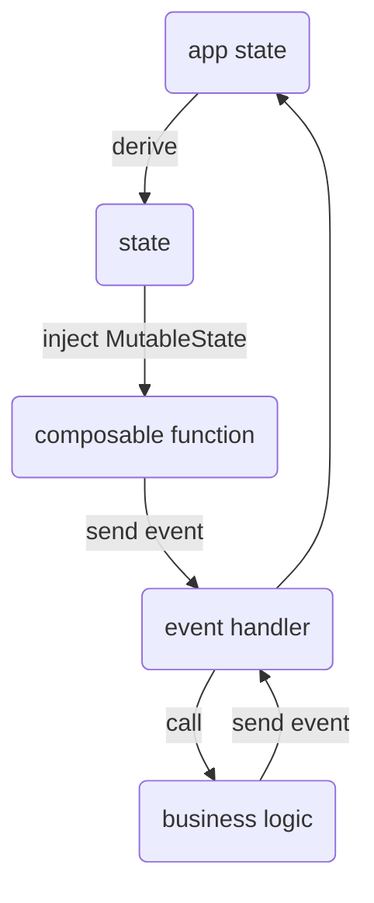

# tila
`Tila` is a Finnish word meaning `state` (among other things).


## Purpose



Tila provides a straightforward way to handle a state in an application.
It enables to extract click handlers away from UI code making it simple.
Also, it makes Composable functions truly transform their state from data.

## Benefits

* Simplify UI code
* Make click handlers testable
* Pass any number of parameters to Composable functions easily
* Make composable functions testable (detached from business logic)
* Make the app testable without UI (drive tests by calling click handlers, not through UI)

## Principles
- Not tied to Android/OS/ViewModel (Jetpack Compose's MutableState dependency exists)
- App data and ui state/data are separated
- Easy to inject a new observed state
- Extract click handlers from UI code
- Easy to preview composable functions with any app data
- Event handlers (click handlers) work with app data and their arguments and produce modified app data
- Click handlers can be tested separately (pure functions)
- Derivatives can be tested separately (pure functions)
- Testable

## Getting started

See the complete example of an Android app using `tila`
at [https://github.com/pmpuro/TilaAndroidExample](https://github.com/pmpuro/TilaAndroidExample/blob/d8ce17cc60114a723254041dd82c82d041767bae/app/src/main/java/com/example/tilaandroidexample/MainActivity.kt).

### Specify dependency

TBD

### Create initial app data

```kotlin
private fun createInitialAppData() = mapOf(Data.counter to 100)

private val machine = createMachine(data = createInitialAppData()) {
    registerEventHandlers()
    registerDerivatives()
}
```

### Inject states and create events

```kotlin
Column {
    val time by remember { machine.injectState<String>(State.timeString) }
    val counter by remember { machine.injectState<Int>(State.counterValue) }
    Greeting("Android")
    Text(text = time)
    Text(text = "counter = $counter")
    Button(onClick = machine.createEvent(Events.click)) {
        Text(text = "Press here")
    }
}
```

### Create and register event handlers

```kotlin
registerEventHandler(Ids.Events.click) { appData, _ ->
    val counter = appData.accessData<Int>(Ids.Data.counter)
    val newValue = counter + 1
    mapOf(Ids.Data.counter to newValue)
}
```

### Create and register derivatives

```kotlin
registerDerivative { appData ->
    val now = appData.accessDataOrNull<String>(Ids.Data.time) ?: "not available yet"
    mapOf(Ids.State.timeString to "Time now is $now")
}
```
